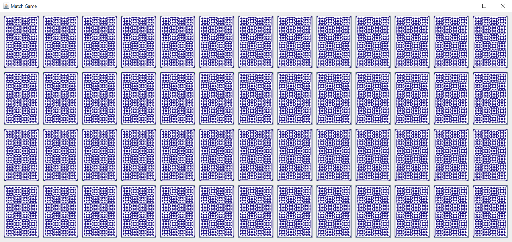
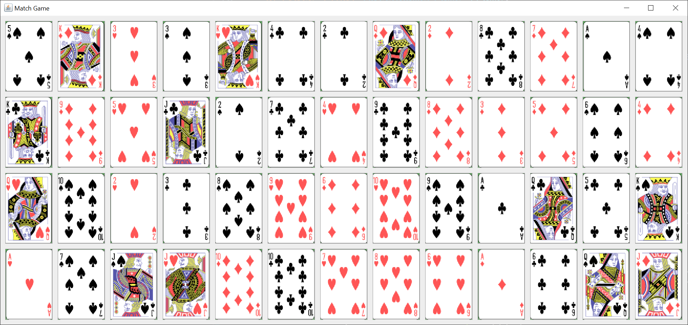
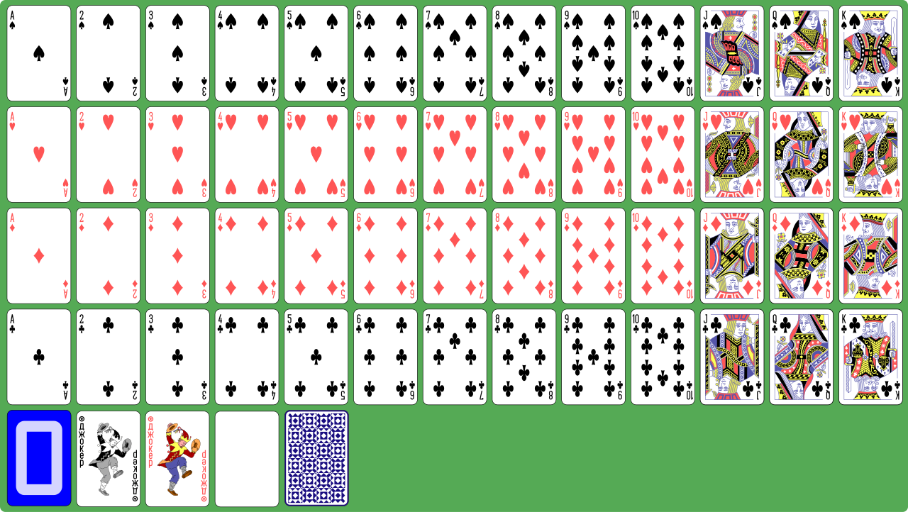

# Match Game

## Introduction

I created a simple Java Swing match game using a standard 52 card deck.  The JFrame is a bit large for some monitors at 1324 x 663 pixels.  Here's what the GUI looks like.

Here's what the GUI looks like after all the cards have matched.

The Reset Game button was added after I snapped the images.

If you’re not familiar with Java Swing, Oracle has an excellent tutorial to get you started, [Creating a GUI With JFC/Swing](https://docs.oracle.com/javase/tutorial/uiswing/index.html). Skip the Netbeans section.

The game takes a standard 52 card deck, shuffles it, and deals the cards out to the 52 buttons.  The player selects two face down cards.  If they match by value, the cards remain face up.  If they don't match by value, the cards are turned face down after 3 seconds.

## Overview

I used an image of a card deck to create the 52 card images and the card back image.  I created a black image that shows when a button is held down.

I coded eight Java classes to create this game.  I used the [model / view / controller](https://en.wikipedia.org/wiki/Model%E2%80%93view%E2%80%93controller) pattern.  This pattern allows me to separate my concerns and focus on one part of the Swing application at a time.

The main class, MatchGame, starts the GUI by executing the SwingUtilities invokeLater method.  This method ensures that the Swing components are created and executed on the [Event Dispatch Thread](https://docs.oracle.com/javase/tutorial/uiswing/concurrency/dispatch.html).

The run method of the MatchGame class creates an instance of the game model, and passes that instance to the game view.  Generally, that's how you create any Swing GUI.  Create an instance of the model and pass that instance to the view.

### Model

The Card class holds one playing card.  A playing card consists of the display value, suit, value, and card image.  The display value is the name of the card (Ace, Two, Three, ..., Jack, Queen, King).  The suit is the card suit (spades, hearts, diamonds, clubs).  The value is the value of the card (1 - 13).  The value corresponds with the display value.  The card image is an image of the card face.

For a different card game, I might also need a suit value so I can determine suit order.  For this game, the suits don't matter.

The Deck class holds a deck of 52 playing cards, a card back image, and a blank image.  The createDeck method creates the deck, card back image and blank image.  The technique used to extract the 52 images is the same technique used to extract multiple images from a single image, the BufferedImage getSubImage method. 

The MatchGameModel class holds one instance of a Deck and two Card instances.  The two Card instances are the Card instances from the first and second button selection on the card JPanel.

### View

The MatchGameFrame class creates a JFrame which holds a card JPanel and a nutton JPanel.  The JFrame uses a default BorderLayout.  The card JPanel is placed in the center of the BorderLayout and the button JPanel is placed after all lines of the BorderLayout.

The card JPanel holds 52 JButtons. 4 rows of 13 cards, using a GridLayout.  I set the default icon, pressed icon, and disabled icon for each of the 52 JButtons.  The idea here is once two JButtons are left-clicked and they match, they are disabled.  This ensures that they will not be left-clicked again during the game.

The button JPanel holds a Reset Game button that shuffles the cards and enables the card JPanel JButtons.

### Controller

The CardListener class disables the first JButton selected.  When the second JButton is selected, the card values are compared.  If they match, the second JButton is disabled.  If they don't match, then a separate thread waits 3 seconds, then enables the first and second JButtons.

The SelectionRunnable class is the Runnable that runs in the separate thread that waits 3 seconds, then enables the first and second JButtons.  We do this to keep the GUI responsive.  Hopefully, the user will wait before selecting another pair of cards, but he is not required to do so.  He can close the JFrame while the runnable is running.

The ResetListener class resets the game by shuffling the cards, dealing the cards to the card JPanel JButtons, and enabling all of the JButtons.
